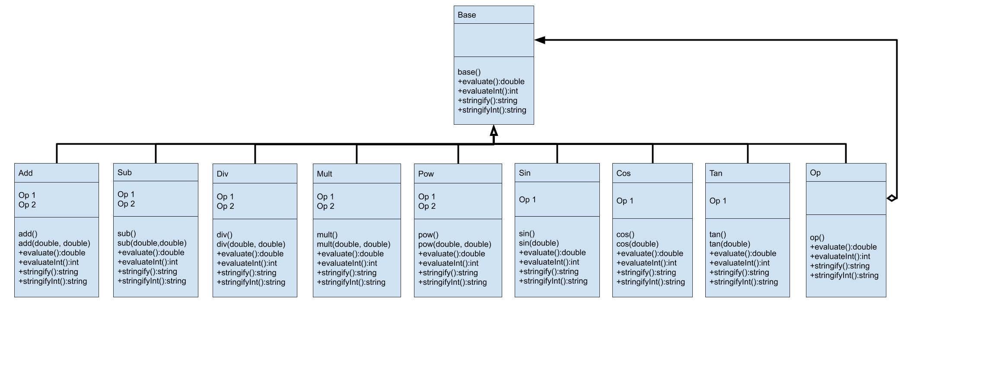
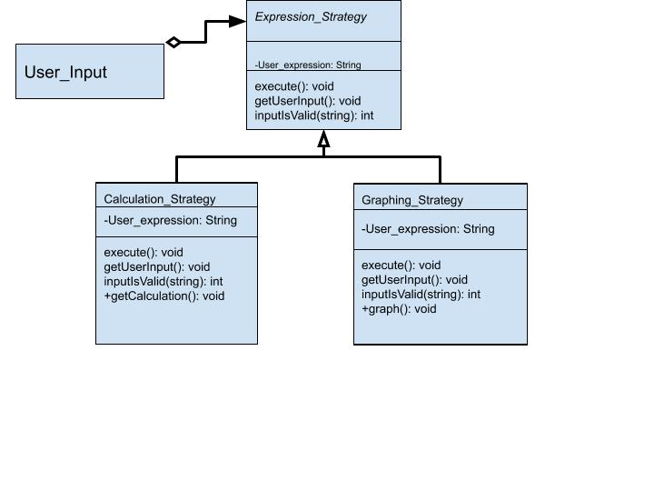
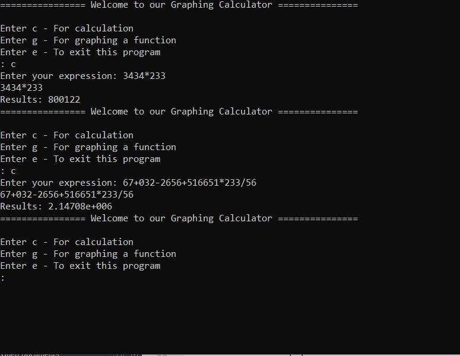
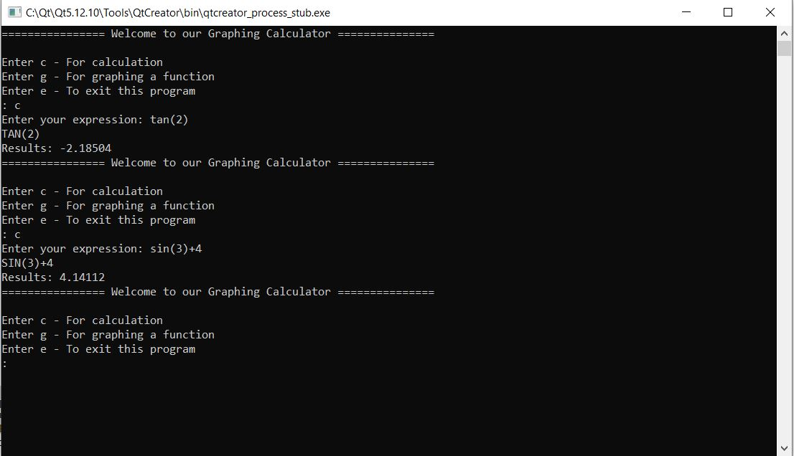
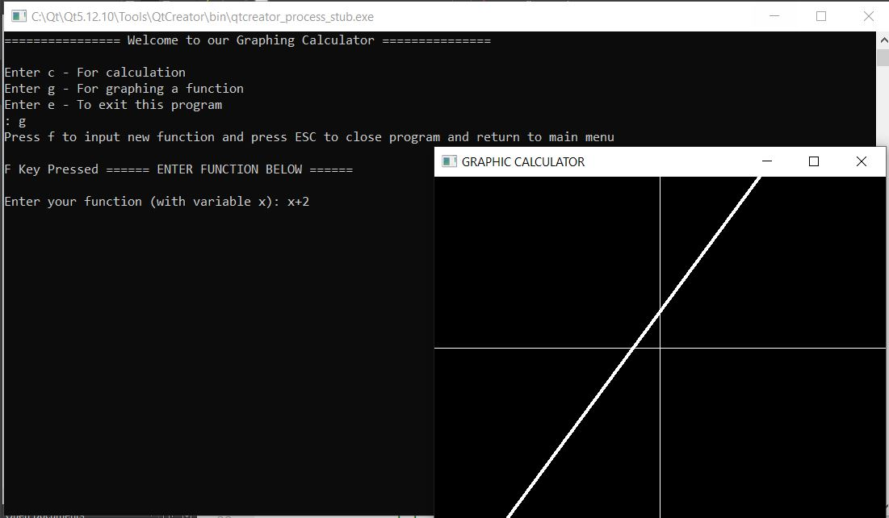
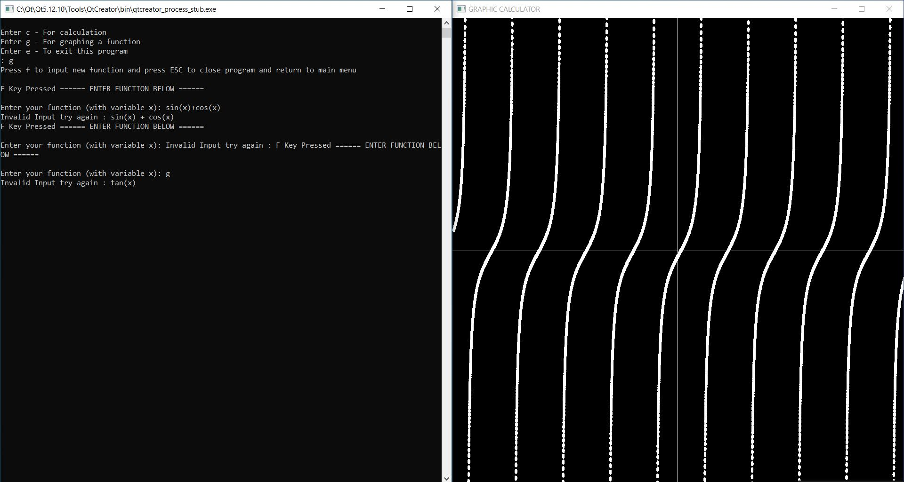

# Graphing Calculator
  Authors:  [Dhruv Parmar](https://github.com/P-Dhruv20), [Yiu Ming Wong](https://github.com/DexterW1), [Jasmine Ojeda](https://github.com/JasmineOjeda)
 
## Project Description
### Why is it important or interesting to you?
 * This project is interesting to us because we want to develop a calculator that is able to perform basic calculations including graphs, as well as functions that would be useful for college students.
### What languages/tools/technologies do you plan to use? (This list may change over the course of the project)
 * We plan to use C++ as our language of choice
 * SFML (for graph and GUI)
### What will be the input/output of your project?
 * Input: String (Character array for user inputted functions/expressions)
 * Output:
   * String (basic calculations)
   * Graph (GUI)
### What are the three design patterns you will be using. For each design pattern you must:
 * Chain of Responsibility: We chose ‘Chain of Responsibility’ because we felt that to create a reliable GUI interface we would need a set of handlers to process the information. For example, by pushing the letter i (for insert), the user will be able to input another expression while the interface is running. This allows the event to go through the chain of responsibility up until it reaches the window where the graph is displayed.
 * Strategy: We chose ‘Strategy’ because we need a design for identifying and executing operations for the basic calculations that will be implemented in the calculator. Each context refers to an arithmetic symbol, which will direct the algorithm to the desired operation that will be performed on the given operands. This design pattern would work well with the Shunting-yard algorithm, which already separates the contexts (operators) from its related operands based on the order of operations.
 * Composite: We chose the 'Composite’ because it will work hand-in-hand with our  ‘Strategy’ design pattern. This design will help match up the arithmetic symbols (the contexts for the strategies) with the needed arithmetic operation object needed for the calculation. It will help keep all the cases for the operation objects in the same place.

 ## Phase II
 ### Composite Pattern

 * Composite Pattern will be used to incorporate operator classes to perform calculations. These classes will be responsible for the performing arithmetic, trigonometric and discrete calculations. For example, after the shunting yard algorithm has provided a precedence for the operations, different classes for the operations are used to perform the operations on the operands based on the precedence.
 
 ### Chain of Responsibility Pattern

 * The Chain of Responsibility will be used by incorporating an SFML panel and dialog with the user’s interactions. For example, if a user presses a button on interface it will go into the class ProcessEvents and from there it will run the function request which checks different handlers. If the handler matches what the user is asking for then it will end and update based on the specific handler. If not it will be sent down to the next handler to see if it matches what the user is asking for
 
 ### Strategy Pattern

 * The Strategy Pattern is where the user input will be processed depending on whether they want to do a simple calculation or to graph a function. This would be determined by a prompted switch statement. If a calculation is requested, the CalculationStrategy class will break down the string expression based on the Shunting-yard algorithm. The expression will then use the Composite Pattern arithmetic classes to calculate the operands accordingly. The output would be stringified integer or double. The GraphingStrategy will also break down the string expression based on the Shunting-yard algorithm, but its output would be a visual graph created from the classes provided in the Chain of Responsibility pattern.

 ### Final deliverable
 
 ## Screenshots
 * Examples of the output for simple calculations
 
 
 
 * Examples of the output for graphing a function
 
 
 
 ## Installation/Usage
 * To install this program please download Qt Creator (https://www.qt.io/offline-installers [offline installer 5.12.x])
 * After running the installation please make sure to check the box 5.12.10 to install the necessary tools. 
 * After Qt has downloaded go to New File or Project -> Import Project -> Git Clone -> Choose.
 * At the top where it says Repository: enter our github link ←------ (https://github.com/cs100/final-project-ywong019-dparm003-jojed016.git).
 * Make sure to check the mark that says recursive then hit next.
 * Please also install SFML (https://www.sfml-dev.org/download/sfml/2.5.1/) and choose [GCC 7.3.0 MinGW (DW2) - 32-bit]. Have project and SFML folders in the same directory.
 * The project should load and you can hit ctrl+r or command+r or press the triangle at the bottom left to run the program.
 
 ## Testing
 * We used googletests to create unit tests for individual functions in each feature, such as ensuring the validation system and the arithmetic operations were satisfactory. We performed manual GUI testing for the graphing feature, verifying with outside sources.
 
